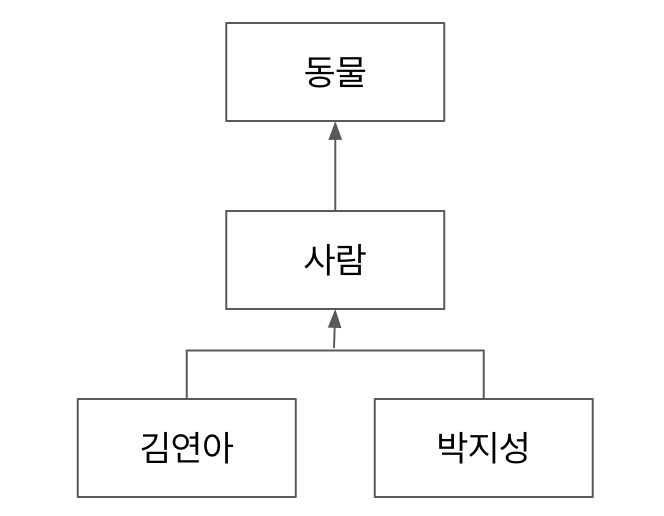

# 클래스의 형변환

다음 다이어그램에서 형변환이 가능하다.

이 다이어그램의 관계는 김연아와 박지성이 사람 클래스의 자식 클래스이며, 사람은 동물의 자식클래스이다.

여기서 위아래로 형변환이 가능하다.

즉, 김연아와 박지성은 사람이 될 수 있고 사람은 동물이 될 수 있다.

반대로 동물은 사람이 될 수 있고, 사람은 김연아와 박지성이 될 수 있다.

그리고 김연아와 박지성은 동물이 될 수 있고, 동물도 김연아와 박지성이 될 수 있다.

하지만, 김연아는 박지성이 될 수 없다. (이우: 위아래 관계가 아니기 때문)